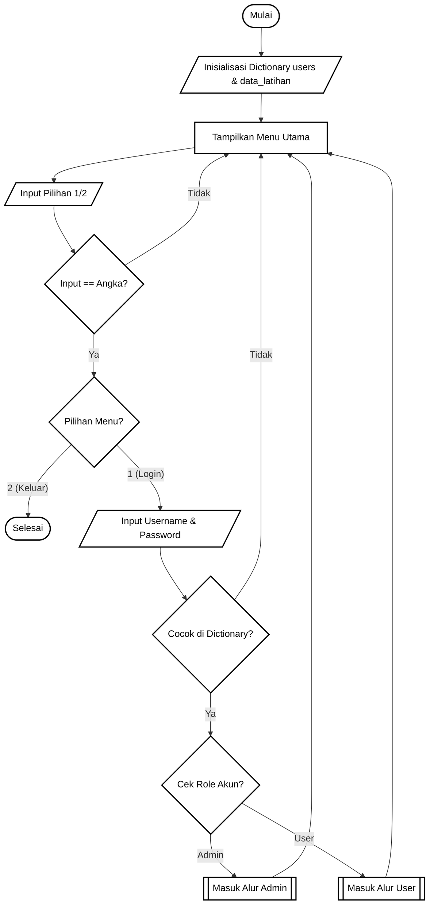
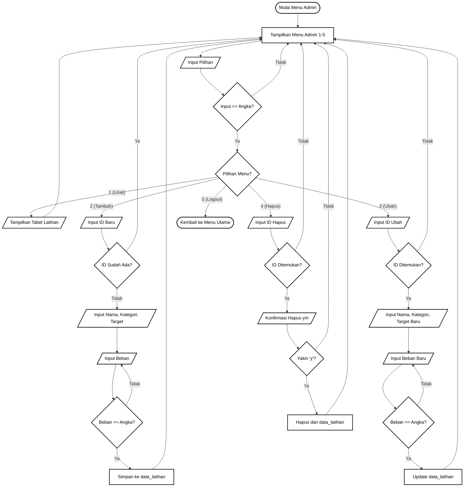
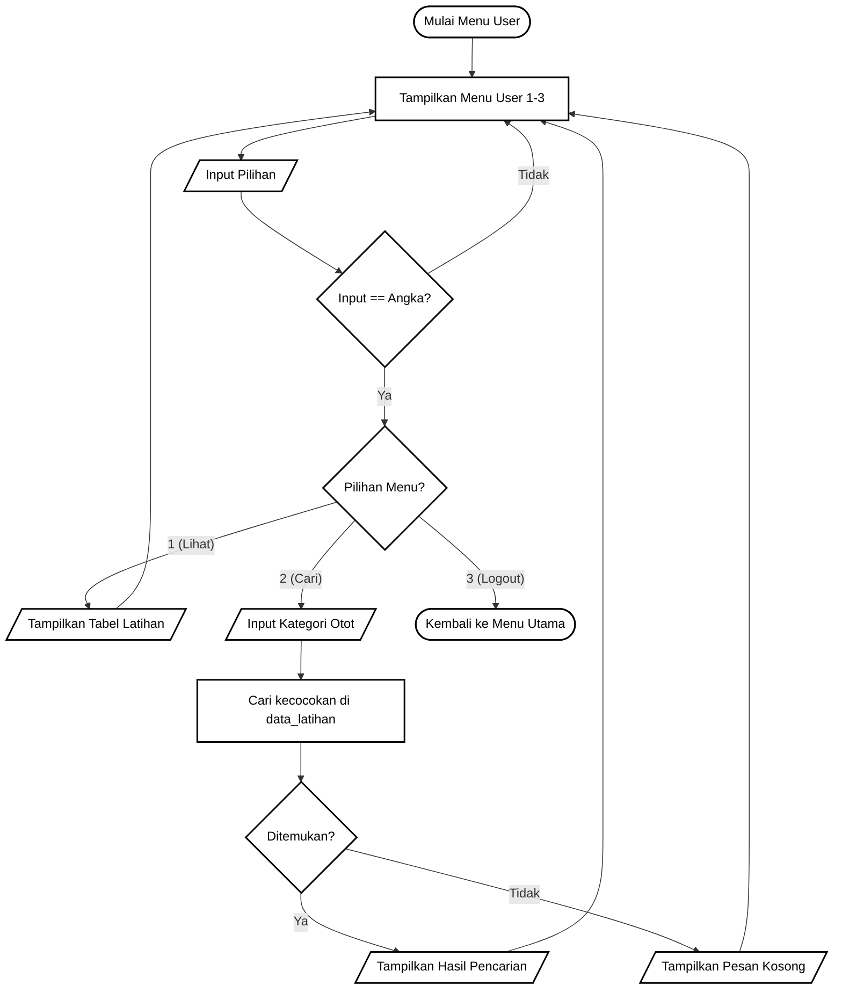

# Mini Project 2: Program Manajemen Latihan Fisik (FitLog)

Nama: Gresius Krisna Samuel
NIM: 058
Kelas:B

# 1. Deskripsi Singkat Program
FitLog adalah program berbasis Command Line Interface (CLI) yang dibangun menggunakan bahasa Python. Program ini dirancang untuk mencatat dan mengelola rencana latihan fisik. di versi ini, program telah dikembangkan sesuai instruksi di GCR.

Program ini memiliki sistem autentikasi (login) sederhana yang membagi pengguna menjadi dua batasan hak akses (role), yaitu:
**Admin**: Memiliki hak akses penuh untuk melakukan operasi CRUD (Create, Read, Update, Delete) pada data latihan.
 **User**: Memiliki hak akses terbatas, yaitu hanya untuk melihat daftar latihan dan mencari latihan berdasarkan kategori otot.

# 2. Gambar Flowchart dan Penjelasan Alur

Program ini dibagi menjadi tiga alur utama untuk memudahkan pembacaan logika berjalannya aplikasi.

# A. Alur Utama (Sistem Login)

# Penjelasan Alur Utama:
Program dimulai dengan menginisialisasi nested dictionary untuk menyimpan data akun dan data latihan. Pengguna akan melihat menu utama untuk memilih Login atau Keluar. Program memvalidasi input tersebut. Jika memilih Login, sistem akan meminta input username dan password. Jika data cocok dengan isi dictionary, sistem akan memeriksa hak akses (role) pengguna dan mengarahkan mereka ke menu Admin atau menu User.

  
# Penjelasan Alur Admin:
Setelah berhasil login sebagai Admin, pengguna akan masuk ke dalam perulangan menu operasi CRUD.

1. Opsi Lihat akan membaca dan memprint seluruh isi tabel
2. Opsi Tambah akan meminta masukan ID baru (divalidasi supaya engga duplikat), beserta kelengkapan data lainnya.
3. Opsi Ubah akan mencari data berdasarkan ID. Jika ditemukan, pengguna dapat memasukkan data baru (atau menekan Enter untuk mempertahankan data lama).
4. Opsi Hapus akan mencari ID, meminta konfirmasi, lalu menghapus elemen dictionary tersebut.
5. Opsi Logout akan mengembalikan pengguna ke menu utama aplikasi.

# Penjelasan Alur User:
Alur user dirancang lebih terbatas. Selain opsi Logout dan Lihat Data, fitur utamanya adalah Cari Data. Pengguna akan menginputkan kata kunci kategori otot. Program akan melakukan perulangan ke dalam dictionary untuk menyaring data yang relevan dan mencetaknya dalam bentuk tabel baru.

# 3. Dokumentasi Program dan Output

A. Tampilan Login dan Penyembunyian Karakter Kata Sandi

Tampilan ini menunjukkan proses login aplikasi. Kata sandi yang dimasukkan oleh pengguna tidak ditampilkan di layar (berubah menjadi asteris) demi keamanan informasi kredensial.

B. Pengujian Akses Admin (Fungsi CRUD)

Tampilan ini menunjukkan menu utama admin serta hasil uji coba penambahan data (Create) dan pembaruan data (Update). Input ID divalidasi agar selalu menggunakan format kapital.

C. Pengujian Akses User (Fungsi Pencarian)

Tampilan ini menunjukkan hak akses pengguna yang masuk sebagai "user". Terdapat proses pencarian data menggunakan kata kunci tertentu (misalnya kategori "Dada"), dan program merespons dengan tabel berisi data yang relevan.

D. Pengujian Kesalahan Input (Error Handling)

Tampilan ini membuat situasi di mana program meminta masukan berupa angka (seperti saat memilih menu atau memasukkan beban), namun diisi dengan huruf. Program menolak masukan tersebut, memberikan pesan peringatan, dan meminta ulang masukan tanpa mengalami crash.

# A. Validasi Error Handling
Program ini dikembangkan supaya tahan terhadap kesalahan input tipe data dengan memanfaatkan fungsi bawaan tipe data string, yaitu .isdigit(). Validasi ini diletakkan pada setiap bagian kode yang membutuhkan input numerik (seperti penentuan angka menu dan penentuan jumlah beban). Jika pengguna memasukkan huruf atau karakter khusus, .isdigit() akan mengembalikan nilai False. Program akan mencetak peringatan error dan mengulang permintaan input tanpa menyebabkan eror yang dapat menghentikan paksa (crash) jalannya program.

# B. Penggunaan 4 Library Python
Program ini memanfaatkan empat pustaka:

os: Digunakan bersama fungsi os.system() untuk membersihkan antarmuka layar terminal secara otomatis pada setiap perpindahan menu.

time: Digunakan bersama fungsi time.sleep() untuk menahan atau memberikan jeda waktu sekian detik sebelum program memuat ulang menu, sehingga pesan notifikasi dapat terbaca oleh pengguna.

pwinput: Digunakan untuk memodifikasi input kata sandi pada menu login. Karakter yang diketik akan disamarkan menjadi tanda bintang (*).

prettytable: Digunakan untuk membangun dan merender data dari dalam dictionary ke dalam format representasi visual tabel ASCII agar struktur data mudah dibaca.

